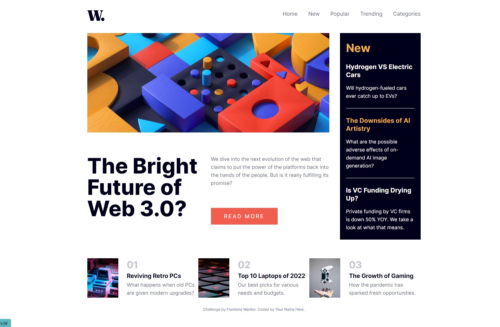
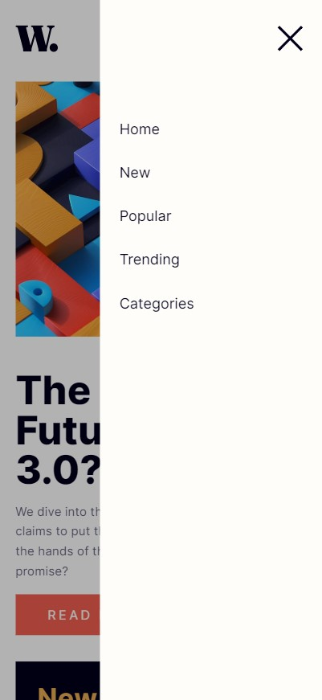

# Frontend Mentor - News homepage solution

This is a solution to the [News homepage challenge on Frontend Mentor](https://www.frontendmentor.io/challenges/news-homepage-H6SWTa1MFl). Frontend Mentor challenges help you improve your coding skills by building realistic projects. 

## Table of contents

- [Overview](#overview)
  - [The challenge](#the-challenge)
  - [Screenshot](#screenshot)
  - [Links](#links)
- [My process](#my-process)
  - [Built with](#built-with)
  - [What I learned](#what-i-learned)
  - [Continued development](#continued-development)
- [Author](#author)

## Overview

### The challenge

Users should be able to:

- View the optimal layout for the interface depending on their device's screen size
- See hover and focus states for all interactive elements on the page

### Screenshot

### Links

- Solution URL: [Add solution URL here](https://github.com/Radu-A/news-homepage-main)
- Live Site URL: [Add live site URL here](https://news-homepage-main-fawn-psi.vercel.app/)

## My process

### Built with

- Semantic HTML5 markup
- CSS custom properties
- Flexbox
- Mobile-first workflow
- JavaScript

### What I learned

- Plan how the elements will be distribuited before to write HTML
- Write organized and semantic HTML
- Layout elements with Flexbox
- Use of media queries to layout elements in two ways to show two views: smartphone and screen
- Strategy to make a dropdown menu in smartphone view: connect HTML, CSS and JavaScript code to make the menu work

### Continued development

Use better strategies in the dropdown menu

## Author

- Github - [Add your name here](https://github.com/Radu-A)
- Frontend Mentor - [@yourusername](https://www.frontendmentor.io/profile/Radu-A)
